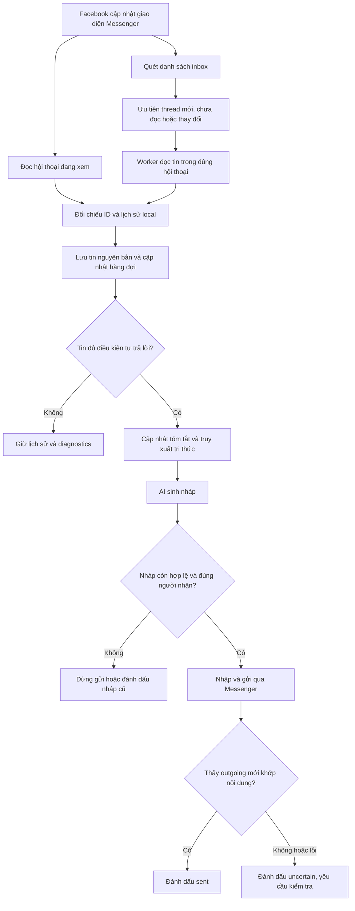
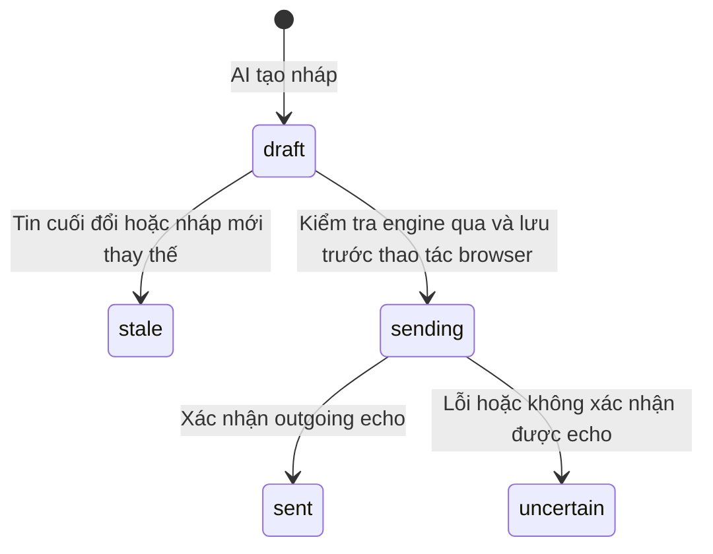

# Master Chat — Cơ chế hoạt động và phát hiện tin nhắn mới

**Ngày cập nhật:** 04/10/2026  
**Phạm vi:** Messenger cá nhân, theo mã nguồn hiện tại của Master Chat.  
**Đối tượng đọc:** người vận hành, người phát triển và người kiểm thử.

Tài liệu mô tả hành vi đã triển khai, các điều kiện cho phép tự trả lời và giới hạn thực tế. Những chức năng chưa có được ghi riêng ở phần cuối. Đây là tài liệu cơ chế, không phải xác nhận rằng một lượt tự trả lời trên tài khoản Messenger thật đã hoàn tất thành công.

## Mục lục

1. [Nguyên lý tổng quát](#1-nguyên-lý-tổng-quát)
2. [Kiến trúc và các thành phần](#2-kiến-trúc-và-các-thành-phần)
3. [Phiên tài khoản, đăng nhập và PIN](#3-phiên-tài-khoản-đăng-nhập-và-pin)
4. [Cách phát hiện tin nhắn mới](#4-cách-phát-hiện-tin-nhắn-mới)
5. [Baseline và mốc thời gian](#5-baseline-và-mốc-thời-gian)
6. [Lưu lịch sử và quản lý ngữ cảnh](#6-lưu-lịch-sử-và-quản-lý-ngữ-cảnh)
7. [Provider, model và tri thức](#7-provider-model-và-tri-thức)
8. [Tạo phản hồi và gửi tin](#8-tạo-phản-hồi-và-gửi-tin)
9. [Pause, resume và xử lý đồng thời](#9-pause-resume-và-xử-lý-đồng-thời)
10. [Chủ động bắt chuyện](#10-chủ-động-bắt-chuyện)
11. [Dữ liệu và bảo mật](#11-dữ-liệu-và-bảo-mật)
12. [Hướng dẫn vận hành](#12-hướng-dẫn-vận-hành)
13. [Chẩn đoán và xử lý lỗi](#13-chẩn-đoán-và-xử-lý-lỗi)
14. [Kiểm thử và tiêu chí nghiệm thu](#14-kiểm-thử-và-tiêu-chí-nghiệm-thu)
15. [Giới hạn và hướng mở rộng](#15-giới-hạn-và-hướng-mở-rộng)
16. [Đối chiếu mã nguồn](#16-đối-chiếu-mã-nguồn)

## 1. Nguyên lý tổng quát

Master Chat mở Messenger bằng Chromium tích hợp trong Electron. Facebook chịu trách nhiệm nhận tin từ mạng và cập nhật giao diện Messenger. Master Chat đọc dữ liệu mà giao diện đó hiển thị, so sánh với lịch sử đã lưu trên máy rồi quyết định có cần trả lời hay không.

Hệ thống hiện không nhận sự kiện tin mới qua một Messenger API chính thức của ứng dụng, không gọi endpoint Facebook nội bộ để lấy tin và không dựa vào AI để phát hiện tin mới. Phát hiện là công việc của bộ đọc DOM và engine; AI chỉ tham gia sau khi đã có dữ liệu phù hợp.



Ba khái niệm cần phân biệt:

| Khái niệm                   | Ý nghĩa                                                                                            |
| --------------------------- | -------------------------------------------------------------------------------------------------- |
| Hội thoại cần kiểm tra      | Inbox có dấu chưa đọc, chữ hiển thị thay đổi hoặc thread mới được phát hiện.                       |
| Tin mới đối với kho local   | Bộ đọc thấy một ID chưa có trong lịch sử của hội thoại. Tin này vẫn có thể là tin cũ vừa được tải. |
| Tin đủ điều kiện tự trả lời | Tin incoming mới, vượt cutoff, không thuộc baseline và đáp ứng các điều kiện vận hành/gửi.         |

Vì vậy, dấu **chưa đọc** không đồng nghĩa với quyền tự trả lời.

## 2. Kiến trúc và các thành phần

### 2.1. Thành phần chính

| Thành phần                | Nhiệm vụ                                                                                              |
| ------------------------- | ----------------------------------------------------------------------------------------------------- |
| React renderer            | Cấu hình tài khoản/AI, danh sách hội thoại, lịch sử, bản nháp, trạng thái theo dõi và nút điều khiển. |
| Electron main process     | Giữ credentials, quản lý browser, vault, engine và giao tiếp có kiểm soát với renderer.               |
| Browser manager           | Tạo phiên riêng theo account, tab/cửa sổ người dùng, inbox monitor, worker và live view.              |
| Bộ đọc Messenger tích hợp | Đọc DOM semantic, nhận diện thread/người nhận/tin nhắn, kiểm tra trước gửi và xác nhận echo.          |
| Engine                    | Lập lịch đọc, áp dụng cutoff, chống trùng, cập nhật ngữ cảnh, tạo nháp và điều phối gửi.              |
| AI transport              | Gọi đúng provider/model cho tác vụ summary, knowledge và reply.                                       |
| Vault                     | Lưu cấu hình, credentials, lịch sử, tri thức, tóm tắt và outbox dưới dạng mã hóa.                     |

### 2.2. Các bề mặt trình duyệt

| Bề mặt                | Vai trò                                                                              |
| --------------------- | ------------------------------------------------------------------------------------ |
| Tab/cửa sổ người dùng | Cho người dùng xem và thao tác Messenger; có thể mở nhiều tab hoặc tách cửa sổ.      |
| Inbox monitor         | Quét danh sách hội thoại của một account, độc lập với tab người dùng.                |
| Worker                | Mở lần lượt các thread để đọc lịch sử và thực hiện gửi.                              |
| Live view             | Giữ hội thoại đang xem để cập nhật tin mới; không bị worker chuyển sang thread khác. |

Các bề mặt của cùng account dùng chung phiên account trong ứng dụng. Account khác có phiên tách riêng. Master Chat không tự nhập phiên từ Chrome mà người dùng đang mở bên ngoài.

Nếu worker/live view gặp bước xác minh hoặc PIN chưa xử lý được, ứng dụng có thể hiện chính bề mặt đó trong cửa sổ riêng để người dùng hoàn tất. Đây là cửa sổ xác minh, không phải một phiên đăng nhập thay thế.

## 3. Phiên tài khoản, đăng nhập và PIN

### 3.1. Đăng nhập

Người dùng có thể cấu hình tên đăng nhập và mật khẩu hoặc đăng nhập thủ công trong browser của ứng dụng. Khi form Facebook phù hợp đã sẵn sàng và có credentials, ứng dụng có luồng tự điền/gửi form.

Không có bảo đảm rằng credentials đúng sẽ luôn vào được Messenger ngay: Facebook có thể yêu cầu xác minh, mã OTP, checkpoint hoặc khôi phục lịch sử mã hóa. Khi gặp bước cần người dùng, ứng dụng hiển thị trạng thái và dừng thao tác tự động liên quan.

Trước khi đọc/gửi, browser kiểm tra danh tính Facebook của phiên qua cookie `c_user` trong session của chính ứng dụng. Nếu account chưa được ràng buộc với Facebook user ID, phiên hợp lệ đầu tiên có thể thiết lập ràng buộc đó; nếu sau này ID khác, thao tác bị từ chối. Tên account do người dùng đặt chỉ là nhãn quản lý.

### 3.2. PIN khôi phục Messenger

PIN là thông tin khôi phục lịch sử Messenger, khác với mật khẩu Facebook và OTP. Người dùng có thể lưu PIN 6 chữ số trong vault và bật tự nhập riêng cho account.

Tự nhập chỉ thực hiện khi bộ nhận diện thấy hộp thoại khôi phục PIN được hỗ trợ trên Messenger chính thức, phiên account đúng và control trống. Ứng dụng không dùng PIN này cho form tạo/đổi/reset PIN hoặc OTP và không ghi đè nội dung người dùng đang nhập.

Trước khi điền PIN, ứng dụng lưu `pinAutoFillBlocked = true`. Nếu PIN sai, timeout hoặc tiến trình bị ngắt, cờ này ngăn thử tự động liên tục, kể cả sau restart. Chỉ khi hộp thoại biến mất và Messenger sẵn sàng qua các lần kiểm tra xác nhận, cờ mới được gỡ. Người dùng cũng có thể kiểm tra rồi lưu lại PIN/cấu hình để cho phép thử lại.

Nếu không khôi phục được, người dùng xử lý tại cửa sổ xác minh. Sau khi hoàn tất, kiểm tra trạng thái rồi chủ động resume nếu engine đang dừng. Hoàn tất PIN không tự cấp quyền bật lại engine.

## 4. Cách phát hiện tin nhắn mới

### 4.1. Hai vòng đọc

| Vòng       | Nhịp đặt hiện tại | Phạm vi                                                               | Khi pause                                             |
| ---------- | ----------------- | --------------------------------------------------------------------- | ----------------------------------------------------- |
| Engine nền | 2.000 ms          | Quét inbox và chọn một nhóm hội thoại để xử lý.                       | Không tiếp tục chu kỳ tự động.                        |
| Live watch | 1.000 ms          | Hội thoại đang được chọn trong ứng dụng, khi watch đã được thiết lập. | Vẫn có thể đọc/cập nhật lịch sử; không tự gọi AI/gửi. |

Đây là nhịp timer, không phải cam kết nhận hoặc trả lời trong 1–2 giây. Một vòng đọc phải chờ trang, xác minh DOM, mạng hoặc AI; vòng trước chưa xong thì vòng sau không chạy chồng. Máy ngủ, mất mạng hoặc ứng dụng không chạy cũng làm gián đoạn theo dõi.

Khi live watch thấy ID cuối thay đổi hoặc còn tin chờ, nó đưa thread vào hàng ưu tiên và yêu cầu engine xử lý nếu engine đang chạy. Khi engine đang bận, yêu cầu này không tạo một vòng xử lý chồng lấn.

### 4.2. Quét inbox

Monitor đọc danh sách link hội thoại trong DOM Messenger, gồm:

- Thread ID và URL, kể cả dạng `/messages/e2ee/t/...` khi được hỗ trợ.
- Tên người nhận đang hiển thị.
- Dấu chưa đọc từ nhãn giao diện.
- Chữ ký từ nội dung nhãn để biết một dòng inbox đã thay đổi.

Monitor luôn kiểm tra phần đầu danh sách rồi tiếp tục vùng phía dưới bằng cuộn có giới hạn. Mỗi lần quét có tối đa 8 đoạn cuộn; vị trí được giữ cho lần quét tiếp theo rồi trang trở về phần đầu. Danh sách dài có thể cần nhiều chu kỳ để đi qua các vùng đã tải.

Kết quả được đối chiếu bằng **account ID + platform thread ID**. Hội thoại mới được thêm vào kho local; hội thoại đã có được cập nhật URL/tên/chữ ký. Dấu chưa đọc hoặc chữ ký khác đưa hội thoại vào hàng ưu tiên.

Trạng thái coverage cần được hiểu đúng:

- `partial`: còn vùng cần tiếp tục cuộn.
- `visible`: đã đọc phần inbox chính mà DOM hiện tải được trong lượt khảo sát; không phải bằng chứng đã phủ mọi loại hộp thư Facebook.

Requests, spam và archive chưa nằm trong cơ chế quét đầy đủ hiện tại.

### 4.3. Không phụ thuộc hoàn toàn vào thứ tự inbox

Facebook có thể redirect URL inbox tới một cuộc trò chuyện hoặc sắp xếp lại danh sách. Master Chat dùng ID của từng link/thread để điều hướng worker, không coi cuộc trò chuyện mà Facebook tự mở là mục tiêu mặc định để gửi.

Ngoài ưu tiên inbox, engine có lượt kiểm tra luân phiên các hội thoại đã biết. Trong một chu kỳ, engine chọn tối đa 4 thread:

1. Hội thoại đang xem, nếu có.
2. Hội thoại có `pendingIds`.
3. Hội thoại trong hàng ưu tiên, cho đến khi nhóm ưu tiên đạt tối đa 3 thread.
4. Một hội thoại khác theo vòng luân phiên, nếu còn.

Do đó, không phải mọi thread đều được đọc mỗi 2 giây. Lượt luân phiên giúp kiểm tra các thread ít thay đổi thứ hạng, nhưng chưa chứng minh rằng mọi tin đến ở mọi vùng inbox đều được phát hiện tức thời. Thread chưa được khám phá vẫn phụ thuộc vào độ phủ quét inbox.

### 4.4. MutationObserver thực sự làm gì?

Bộ đọc gắn `MutationObserver` để ghi nhận thay đổi cây DOM và tăng revision. Đây là dấu hiệu giao diện đã thay đổi.

Ở bản hiện tại, revision không tạo trực tiếp một sự kiện push tin nhắn vào engine. Cơ chế phát hiện vẫn dựa vào các lần đọc theo timer và đối chiếu dữ liệu. Không nên mô tả hệ thống là đã có webhook hoặc listener sự kiện Messenger hoàn chỉnh.

### 4.5. Đọc tin trong hội thoại

Bộ đọc tích hợp nhận diện tin qua DOM semantic và nhãn accessibility. Nó trích xuất văn bản, hướng tin và thời gian có thể đọc được:

| Trường       | Ý nghĩa                                                                     |
| ------------ | --------------------------------------------------------------------------- |
| `id`         | Message ID của nền tảng nếu DOM cung cấp; nếu thiếu thì dùng fingerprint.   |
| `text`       | Văn bản mà bộ đọc trích xuất được từ tin hiển thị.                          |
| `direction`  | `incoming`, `outgoing` hoặc `system` theo adapter.                          |
| `timestamp`  | Thời điểm suy ra từ nhãn được hỗ trợ; `null` nếu không đủ rõ.               |
| `observedAt` | Thời điểm Master Chat đọc được tin.                                         |
| `identity`   | Cho biết ID đến từ nền tảng hay fingerprint.                                |
| `precision`  | Độ chính xác thời gian: chính xác hoặc đến phút, khi adapter xác định được. |
| `baseline`   | Tin thuộc lần nạp nền đầu tiên của hội thoại.                               |

`observedAt` không phải thời điểm gửi/nhận thực tế. Một tin cũ vừa cuộn ra hôm nay có `observedAt` hôm nay, nhưng không được biến thành tin mới chỉ vì vậy.

### 4.6. Chống trùng

Engine so ID đọc được với tập ID đã lưu. Chỉ ID chưa có mới được bổ sung vào lịch sử và xét làm trigger.

Nếu DOM thiếu message ID, fingerprint được suy ra từ thread, hướng, nội dung và thời gian/nhãn thời gian. Fingerprint giúp giảm nhập trùng nhưng không phải ID chính thức hoặc bằng chứng mật mã về danh tính tin nhắn.

Hai tin giống hoàn toàn trong cùng phút có thể không phân biệt được. Nếu kết quả DOM có định danh trùng gây mơ hồ, bộ đọc chặn thao tác thay vì giả định tin nào là mới. Thay đổi nhãn ngày, sửa/xóa tin và các dạng nội dung khác vẫn cần reconciliation tốt hơn; vì vậy hệ thống chưa có bảo đảm xử lý đúng một lần tuyệt đối.

## 5. Baseline và mốc thời gian

### 5.1. Hai lớp bảo vệ

**Baseline của hội thoại:** lần đầu đọc một hội thoại chưa `initialized`, toàn bộ tin nạp trong lần đó được đánh dấu nền và không kích hoạt tự trả lời. Đây là cơ chế bảo vệ đối với lịch sử đã tồn tại, kể cả tin chưa đọc.

**Cutoff của account:** thời điểm tối thiểu mà tin phải vượt qua để đủ điều kiện tự trả lời.

```text
cutoff = max(enabledAt, account.monitorStartedAt)
```

Trong đó:

- `enabledAt` được ghi ở lần resume đầu tiên của engine.
- `monitorStartedAt` được ghi ở lần quét inbox đầu tiên của account.
- Nếu account chưa có `monitorStartedAt`, engine dùng `enabledAt` làm giá trị dự phòng.
- Trước khi có `enabledAt`, việc nạp dữ liệu không tạo trigger trả lời.

Hai mốc được lưu trong vault và không đổi mỗi lần pause/resume hoặc restart. Cutoff này là mốc triển khai thực tế, không phải một trường ngày giờ tùy chọn do người dùng nhập.

### 5.2. Hội thoại được khám phá sau baseline inbox

Sau khi account đã có baseline inbox, thread được khám phá ở các lần quét sau có thể được đánh dấu `initialized` trước lần đọc tin đầu. Khi đó tin incoming trong lần đọc đầu vẫn có thể trở thành trigger, nhưng phải vượt cutoff và đáp ứng các điều kiện còn lại.

Quy tắc này cho phép trả lời người vừa bắt chuyện sau khi hệ thống bắt đầu theo dõi. Nó cũng áp dụng cho thread cũ ở vùng sâu vừa được khám phá: tin cũ vẫn bị cutoff loại bỏ; tin thực sự sau cutoff có thể được xử lý.

Ngược lại, với thread nằm trong lần khám phá nền đầu tiên, lần nạp tin đầu tiên vẫn là baseline. Tin đến trước khi baseline của thread hoàn tất có thể chỉ được lưu làm ngữ cảnh. Đây là đánh đổi hiện tại để tránh trả lời lịch sử cũ.

### 5.3. Điều kiện thêm vào hàng chờ

Một tin chỉ được bổ sung vào `pendingIds` khi đồng thời:

1. ID chưa có trong lịch sử local.
2. Không phải tin baseline.
3. Có hướng `incoming`.
4. Có `timestamp` xác định được và engine đã có cutoff.
5. `timestamp > cutoff`.
6. Timestamp không lớn hơn `observedAt + 60 giây`, để loại dữ liệu thời gian bất hợp lý rõ rệt.

Sau khi nhập, pending còn được lọc để chỉ giữ tin nằm sau outgoing cuối cùng trong lịch sử và vẫn vượt cutoff. Nếu người dùng đã trả lời thủ công và bộ đọc nhận diện outgoing đó, các trigger trước outgoing được loại khỏi hàng chờ.

```text
fresh = các tin có ID chưa lưu
lưu fresh vào lịch sử, kèm cờ baseline

eligible = fresh thỏa incoming + không baseline + thời gian hợp lệ + vượt cutoff
pendingIds = hợp nhất pending cũ với ID của eligible
pendingIds = chỉ giữ tin sau outgoing cuối và vẫn vượt cutoff
```

Đây là mã giả để giải thích; mã nguồn là cơ sở xác định hành vi chính xác.

### 5.4. Thời gian đến phút

Nếu cutoff là **10:30:25** và Messenger chỉ hiển thị **10:30**, timestamp suy ra là 10:30:00 nên không vượt cutoff. Tin đó không được dùng để tự trả lời, dù có thể đến lúc 10:30:40.

Với nhãn **10:31**, nếu được diễn giải thành thời điểm hợp lệ của ngày đang hiển thị và đáp ứng các điều kiện khác, tin có thể được xét. Hệ thống ưu tiên không trả lời nhầm tin cũ, chấp nhận bỏ qua một số tin trong phút chứa cutoff.

Nhãn ngày giờ đầy đủ, ISO có múi giờ hoặc epoch được hỗ trợ khi adapter nhận diện được. Nhãn chỉ có giờ được diễn giải theo quy ước hiển thị ngày hiện tại; nhãn tương đối hoặc thứ/ngày thiếu thông tin mà parser chưa hỗ trợ có thể trả `null`. Không dùng thời gian lúc quét để bù cho timestamp thiếu.

### 5.5. Các ví dụ vận hành

| Tình huống                              | Kết quả dự kiến theo cơ chế                                                 |
| --------------------------------------- | --------------------------------------------------------------------------- |
| Tin unread từ trước cutoff              | Lưu ngữ cảnh; không tạo trigger tự trả lời.                                 |
| Tin trong lần nạp baseline              | Lưu ngữ cảnh; không tạo trigger, kể cả vượt cutoff.                         |
| Incoming mới, có thời gian, vượt cutoff | Có thể vào pending; vẫn cần quyền auto và kiểm tra gửi.                     |
| Thread mới sau baseline inbox           | Lần đọc đầu có thể tạo pending cho incoming vượt cutoff.                    |
| Tin thiếu thời gian                     | Giữ raw và diagnostics; không tạo trigger.                                  |
| Đọc lại cùng ID sau restart             | Không thêm như một tin mới.                                                 |
| Outgoing thủ công sau các incoming chờ  | Loại pending đứng trước outgoing khi đã đọc được outgoing đó.               |
| Pause rồi có incoming đủ điều kiện      | Nếu được live/manual sync đọc, vẫn có thể vào pending; resume có thể xử lý. |

Pause không mặc nhiên có nghĩa là bỏ qua mọi tin đến trong thời gian dừng. Muốn có chính sách bỏ qua giai đoạn pause cần một cơ chế khác, hiện chưa có.

## 6. Lưu lịch sử và quản lý ngữ cảnh

### 6.1. Lịch sử nguyên bản

Mỗi hội thoại có mảng tin riêng trong vault. Tin đã đọc được giữ để xem lại, xây dựng history và tóm tắt mà không phải tải lại toàn bộ qua browser ở mỗi lượt AI.

“Nguyên bản” ở bản hiện tại là văn bản/hướng/thời gian mà adapter đã trích xuất được, không phải toàn bộ payload Messenger hay bản sao đầy đủ mọi media. Ảnh/tin thoại được lưu metadata và kết quả phân tích; reaction, edit/delete và mọi dạng system event vẫn chưa có mô hình hoàn chỉnh.

Khi đọc hội thoại lần đầu chưa có tin local, native worker cuộn ngược có giới hạn để cố nạp tối đa **100 tin** với tối đa 12 bước cuộn. **Nạp thêm lịch sử** cố lấy thêm một cửa sổ lớn hơn số tin đã lưu 500 tin, tối đa 5.000 tin và 60 bước cuộn trong worker. DOM có thể chỉ cung cấp ít hơn; đây không phải bảo đảm luôn nạp đủ. Dữ liệu nhập lịch sử có baseline=true, không tạo pending reply; cửa sổ Messenger hiển thị của người dùng không bị cuộn.

Live view không cuộn ngược để tải lịch sử: nó giữ thread hiện tại và đọc phần đã có trong DOM. Khi đã có lịch sử local, worker không tải lại toàn bộ các trang cũ mỗi lượt.

### 6.2. Cửa sổ ngữ cảnh

Yêu cầu “từ tin thứ 10 về trước” được hiện thực bằng cửa sổ **9 tin gần nhất** giữ nguyên trong history.

```text
Lịch sử theo thời gian:
[ phần cũ đã/chưa tóm tắt ................................ ][ 9 tin gần nhất ]
                         ↓                                           ↓
                 summary tích lũy                              history nguyên văn
                         └─────────────────┬─────────────────────────┘
                                           ↓
                                    model sinh phản hồi
```

Các tin ngoài cửa sổ 9 gần nhất, chưa nằm trong `summary.coveredIds`, được lấy thành batch tối đa 50 tin cho một lần gọi summary. Engine có thể chạy nhiều batch liên tiếp khi có nhiều tin chưa được phủ; 50 là giới hạn mỗi batch, không phải giới hạn tổng số tin trong một hội thoại.

### 6.3. Tóm tắt tăng dần

Đầu vào summary gồm bản tóm tắt hiện có và các tin cũ chưa được phủ. Kết quả thay thế summary cũ, bổ sung `coveredIds` và tăng `revision`.

Ví dụ, ban đầu có 59 tin:

1. 50 tin cũ được tóm tắt.
2. 9 tin cuối được gửi nguyên văn cho tác vụ reply.
3. Khi thêm 1 tin, tin vừa rời cửa sổ 9 tin được tóm tắt cùng summary cũ.
4. Nếu nhiều tin đến giữa hai lượt xử lý, batch có thể chứa nhiều tin vừa rời cửa sổ.

Hội thoại mới có không quá 9 tin sẽ chưa cần gọi summary. Sau khi vượt cửa sổ này, các tin cũ bắt đầu được đưa vào summary. Raw history vẫn được giữ sau khi tóm tắt.

Trước khi ghi kết quả summary, engine kiểm tra epoch và revision để tránh ghi đè kết quả đã mất hiệu lực. Tuy nhiên, tóm tắt AI vẫn có thể bỏ sót chi tiết; raw history là dữ liệu đối chiếu, không có bảo đảm summary luôn giữ mọi thông tin.

### 6.4. History gửi cho reply

Tin incoming/outgoing gần nhất được chuyển thành lượt hội thoại cho model; summary và tri thức được cung cấp như dữ liệu ngữ cảnh. Mục tiêu là giữ xưng hô, nội dung vừa trao đổi và diễn tiến gần nhất mà không tóm tắt lại toàn bộ.

Hiện chưa có cơ chế vector search toàn bộ raw history để tự kéo mọi chi tiết cũ vào mỗi câu trả lời. Có raw local không đồng nghĩa model được đọc toàn bộ raw trong mọi request.

## 7. Provider, model và tri thức

### 7.1. Cấu hình hai tầng

**Provider** giữ loại giao thức, Base URL, API key, trạng thái bật/tắt, quyền gọi endpoint từ xa và danh sách model được chọn. **Model theo tác vụ** chọn provider/model mặc định và override riêng cho từng role.

```text
model tác vụ = override của role nếu có, nếu không dùng model mặc định
```

| Role        | Nhiệm vụ                                                  | Khi gọi                                            |
| ----------- | --------------------------------------------------------- | -------------------------------------------------- |
| `summary`   | Cập nhật tóm tắt phần lịch sử cũ.                         | Có batch chưa được phủ và luồng xử lý cần summary. |
| `knowledge` | Chọn facts liên quan từ nguồn tri thức local đã tìm được. | Có nguồn khớp truy vấn.                            |
| `reply`     | Viết nội dung tin phản hồi hoặc tin chủ động.             | Tạo nháp.                                          |

Các role là các lượt gọi model do engine điều phối; chưa phải những agent nghiên cứu độc lập tự duyệt web. Role `knowledge` hiện xử lý tài liệu local được cung cấp, không tự tìm kiếm Internet.

Nếu provider bị tắt, model chưa được bật hoặc assignment không hợp lệ, tác vụ báo lỗi. Không tự chọn một provider khác để tiếp tục.

### 7.2. Danh sách model và kiểm tra kết nối

Giao diện có catalog model và hỗ trợ tải thêm danh sách từ provider, nhập ID tùy chỉnh, tick model cần dùng và kiểm tra kết nối. Catalog là gợi ý cấu hình; quyền truy cập và khả năng gọi thực tế phụ thuộc endpoint/tài khoản của người dùng.

Một request kiểm tra ngắn thành công chỉ chứng minh request đó thành công. Request tạo phản hồi với history dài hơn vẫn có thể lỗi do provider, quota hoặc giới hạn khác. Không dùng kết quả test provider để khẳng định toàn bộ luồng trả lời đã hoạt động.

### 7.3. Tri thức local hiện tại

Người dùng thêm tài liệu text với scope chung hoặc theo account. Truy xuất hiện tại:

1. Lấy truy vấn từ mục tiêu chủ động hoặc văn bản 9 tin gần nhất.
2. Tách từ khóa, bỏ từ quá ngắn và tính số từ khớp trong tiêu đề/nội dung.
3. Chỉ xét tài liệu dùng chung hoặc thuộc account hiện tại.
4. Chọn tối đa 5 nguồn có điểm khớp dương.
5. Cung cấp tối đa 8.000 ký tự mỗi nguồn cho role knowledge để chọn facts liên quan.

Đây là retrieval theo từ khóa, chưa có embedding/vector database hoặc tìm kiếm ngữ nghĩa hoàn chỉnh. Từ đồng nghĩa và cách diễn đạt khác có thể không tìm được nguồn phù hợp. Scope account cũng chưa phải scope riêng từng người nhận; chỉ nên nhập thông tin mà account được phép dùng trong các hội thoại của mình.

### 7.4. Quyền sử dụng cloud

Endpoint từ xa chỉ được gọi khi người dùng bật quyền cloud cho provider đó. Ảnh được đọc bởi model reply hoặc lựa chọn riêng; audio được phiên âm local hoặc dịch vụ STT riêng. Tác vụ dựng hồ sơ dùng model reply. Model kiểm tra phải khác model viết; tự chọn chỉ trong cùng provider reply, lựa chọn riêng tuân theo quyền cloud/provider. Khi được bật, các tác vụ dùng provider có thể gửi history, summary, tri thức liên quan hoặc mục tiêu bắt chuyện trực tiếp tới endpoint đã cấu hình.

Quyền được kiểm tra theo endpoint, không chỉ theo tên loại provider. Không có server trung gian của Master Chat; không tự redirect hoặc fallback sang dịch vụ khác. Credentials Facebook, cookies và PIN không được đưa vào payload AI.

## 8. Tạo phản hồi và gửi tin

### 8.1. Điều kiện để engine tự tạo/gửi phản hồi

Sau khi đọc hội thoại, engine chỉ vào nhánh tự trả lời nếu:

- Engine đang chạy.
- Tự trả lời thực tế của hội thoại bật: `autoReply: null` kế thừa `autoDiscoverReply` của tài khoản; `true`/`false` ghi đè riêng.
- Có pending và ID tin cuối nằm trong pending.
- Tin cuối là incoming.
- Nếu dùng DOM profile tùy chỉnh, profile đã được xác minh.
- Hội thoại không có bản nháp `sending` hoặc `uncertain`, nháp thủ công đang chờ, hay nội dung đang soạn trong ô chat của ứng dụng.

Switch trong hội thoại chỉ có **Theo hệ thống**, **Tắt**, **Bật**. Hội thoại mới kế thừa mặc định tài khoản; các giá trị boolean đã lưu từ bản cũ giữ nguyên. Thiết lập mặc định tài khoản áp dụng cho mọi hội thoại đang **Theo hệ thống**, kể cả hội thoại hiện có. **Bật hệ thống**/**Tắt hệ thống** cập nhật mặc định của mọi tài khoản và giữ lựa chọn riêng. Bật hệ thống chạy engine; tắt hệ thống vẫn đồng bộ và các hội thoại ghi đè **Bật** vẫn có thể tự trả lời nếu engine đang chạy. **Tạm dừng** luôn chặn tự trả lời ở mọi chế độ.

Khi engine hoạt động, summary có thể được cập nhật ngay cả ở hội thoại không bật auto nếu có batch và model summary/default đã cấu hình. Tắt auto của thread chặn tự trả lời, không đồng nghĩa chặn mọi xử lý ngữ cảnh.

### 8.2. Tạo bản nháp

Engine đọc media chưa có kết quả, cập nhật phong cách riêng khi đủ mẫu mới, cập nhật summary, lấy tri thức liên quan rồi gọi role reply. Prompt yêu cầu dựa vào ngữ cảnh/xưng hô, không bịa facts hoặc cam kết và chỉ trả nội dung tin nhắn. History/tri thức được xem là dữ liệu, không phải chỉ thị hệ thống; đây là chỉ dẫn cho model, không phải bảo đảm model không thể sai.

Nháp lưu các trường:

| Trường           | Vai trò                                                                |
| ---------------- | ---------------------------------------------------------------------- |
| `conversationId` | Hội thoại đích.                                                        |
| `basedOnId`      | ID tin cuối mà nháp dựa vào.                                           |
| `triggerIds`     | Các incoming chờ đã được đưa vào lượt phản hồi.                        |
| `proactive`      | Nháp bắt chuyện theo mục tiêu của chủ tài khoản.                       |
| `automatic`      | Nháp do vòng tự trả lời tạo; nháp thủ công không bị vòng nền thay thế. |
| `status`         | Trạng thái outbox.                                                     |
| `createdAt`      | Thời điểm tạo.                                                         |

Nếu tin cuối đổi trong lúc AI soạn hoặc engine đã pause/đổi epoch, kết quả không được dùng như một nháp hợp lệ cho tình huống cũ. Nháp mới cũng làm các nháp `draft` trước đó của cùng thread thành `stale`. Nội dung AI dài hơn 5.000 ký tự bị từ chối.

Nhiều tin đến có thể cùng nằm trong pending và được xử lý bằng một phản hồi. Hiện không có một khoảng debounce cố định đảm bảo chờ người nhận gõ xong toàn bộ chuỗi tin; việc gom phụ thuộc thời điểm đọc và xử lý.

### 8.3. Kiểm tra trước và trong khi gửi

Trước gửi, engine đọc lại hội thoại để xác nhận nháp còn dựa trên đúng tin cuối, quyền auto còn hợp lệ và trigger vẫn còn chờ. Browser tiếp tục kiểm tra:

1. Phiên đang thuộc đúng Facebook account.
2. URL thuộc Facebook HTTPS được hỗ trợ và chứa đúng thread ID.
3. Hội thoại được chọn trong DOM khớp với mục tiêu.
4. Nhãn người nhận/composer khớp với tên hội thoại.
5. Không có bước xác minh/PIN đang chặn.
6. Không có định danh tin mơ hồ.
7. Tin cuối khớp `basedOnId`.
8. Composer trống trước khi nhập, kể cả tab người dùng đang mở cùng thread được kiểm tra trước gửi.
9. Sau khi nhập, composer đúng nội dung nháp; nút gửi semantic hợp lệ, không phải nút gửi lượt thích.
10. Epoch không đổi tại các điểm kiểm tra trước thao tác. Với gửi tự động, engine phải đang chạy, quyền auto còn bật và người dùng không đang soạn tin; gửi thủ công không yêu cầu resume.

Nếu Messenger thiếu dấu chọn `aria-current`, bộ đọc chỉ dùng fallback khi URL, tên duy nhất trong inbox, vùng hội thoại và người nhận composer cùng khớp. URL đơn lẻ không đủ. Dấu chọn xung đột, tên bị trùng hoặc vùng người nhận cũ sẽ chặn.

Ứng dụng nhập qua Chromium để tạo sự kiện chỉnh sửa thực, sau đó bấm control gửi đã được kiểm tra. Nó không gửi bằng endpoint Facebook ẩn.

### 8.4. Xác nhận outgoing echo

Sau thao tác gửi, browser đọc lại tối đa 12 lần, cách nhau 350 ms, tìm tin mới có:

- Hướng outgoing.
- Nội dung khớp chính xác nội dung nháp.
- ID chưa có trong tập tin đọc trước thao tác gửi.
- Thread vẫn đúng và không bị chặn.

Nếu tìm được, outbox thành `sent` và các trigger tương ứng được loại khỏi pending. `sent` ở đây có nghĩa là đã thấy tin outgoing mới trong DOM, không phải xác nhận người nhận đã đọc hay receipt chính thức về giao nhận từ server.

### 8.5. Trạng thái outbox



| Trạng thái  | Ý nghĩa và xử lý                                                            |
| ----------- | --------------------------------------------------------------------------- |
| `draft`     | Có thể xem/sửa; gửi còn phải qua kiểm tra.                                  |
| `stale`     | Không còn phù hợp với tin cuối; cần tạo nháp lại.                           |
| `sending`   | Đã ghi ý định gửi vào vault, đang thực hiện luồng browser.                  |
| `sent`      | Browser đã xác nhận outgoing echo hoặc người dùng đã xác nhận thủ công.     |
| `uncertain` | Chưa chắc kết quả; chặn gửi tiếp trong thread cho đến khi người dùng xử lý. |

Một lỗi sau khi đã chuyển `sending`, kể cả lỗi trước khi bấm nút gửi, có thể thành `uncertain`. Lỗi AI trước khi có nháp không tự tạo trạng thái này. Khi khởi động lại, `sending` còn dở được chuyển thành `uncertain`.

Với `uncertain`, ứng dụng không tự gửi lại. Người dùng kiểm tra Messenger rồi chọn **Tôi xác nhận đã gửi** hoặc **Chưa gửi, bỏ nháp**. Cả hai nhánh dừng engine và loại trigger liên quan khỏi hàng đợi; nhánh bỏ nháp không phải yêu cầu thử gửi lại.

## 9. Pause, resume và xử lý đồng thời

### 9.1. Hành vi điều khiển

Ứng dụng khởi động trong trạng thái paused. Auto của hội thoại có thể vẫn bật trong cấu hình nhưng engine không tự gửi cho đến khi resume.

| Hoạt động                               | Khi engine paused                                                                  |
| --------------------------------------- | ---------------------------------------------------------------------------------- |
| Quét/đọc tự động của tick               | Dừng xử lý chu kỳ.                                                                 |
| Live watch của thread đang xem          | Có thể tiếp tục cập nhật raw và pending.                                           |
| Quét inbox/nạp lịch sử thủ công         | Được phép; thao tác sync không tự gọi AI/gửi.                                      |
| Tạo nháp thủ công theo yêu cầu          | Được phép, có thể gọi model đã cấu hình.                                           |
| Tự tạo phản hồi trong tick              | Không thực hiện.                                                                   |
| Gửi tự động                             | Bị chặn cho đến khi resume và các guard qua.                                       |
| Gửi thủ công hoặc gửi nháp theo yêu cầu | Được phép khi các guard account/thread/composer/outbox qua; không bật lại tự động. |

Pause tăng epoch và hủy request AI đang được quản lý bằng AbortController. Kết quả về muộn bị kiểm tra epoch để không tiếp tục luồng cũ. Pause không thể thu hồi một tin mà thao tác gửi đã được thực hiện trước đó; nếu không xác nhận được kết quả, vẫn cần kiểm tra outbox/Messenger.

### 9.2. Kiểm soát đồng thời

- `busy` ngăn hai tick engine chạy chồng.
- `liveBusy` ngăn hai lượt live read chồng.
- Lock theo conversation ngăn các thao tác engine chính cùng xử lý một thread.
- Hàng thao tác theo account tuần tự hóa monitor/worker sử dụng cùng account.
- Live view là bề mặt riêng để cập nhật khi worker đang đọc thread khác hoặc AI đang soạn.
- Vault tuần tự hóa mutation để ghi dữ liệu nhất quán.

Live read có thể phát hiện tin mới khi AI đang soạn; đó là lý do engine phải kiểm tra lại `basedOnId` trước khi lưu/gửi. Những kiểm tra này giảm rủi ro phản hồi cũ nhưng không tạo giao dịch nguyên tử với hệ thống Facebook: vẫn có cửa sổ thời gian rất ngắn giữa kiểm tra DOM và thao tác thực.

### 9.3. Nhịp gõ, media và phong cách tùy chọn

Cấu hình chung nằm ở **Cấu hình AI → Phong cách & nhịp trả lời**. Các trường mô tả bản thân, tính cách, instructions, model media và tốc độ gõ đều có thể bỏ trống. Phong cách riêng trong sidebar của hội thoại ưu tiên hơn phong cách tự học/chung. Tự học mặc định bật: dựng hồ sơ từ ít nhất 50 tin có nội dung của hai phía, loại tin AI đã gửi và sự kiện nền tảng. Quan hệ/xưng hô dùng lịch sử hai phía, phong cách chỉ dựa vào outgoing của chủ tài khoản. Phân tích toàn bộ tin có sẵn theo phần tối đa 100 tin/32.000 ký tự; mỗi tin đưa vào phần được giới hạn 4.000 ký tự. Hồ sơ có dẫn chứng được kiểm tra ID, lưu vault và cập nhật khi thêm 10 tin. Sửa nội dung tin dẫn chứng làm hồ sơ cũ bị bỏ và dựng lại; lỗi được ghi nhận để không gọi lặp mỗi tick, có Dựng lại hồ sơ. Khi chưa đủ tin, dùng phong cách chung và ngữ cảnh người dùng cung cấp.

Ảnh/tin thoại được nhận diện từ DOM semantic và tải trong đúng phiên tài khoản. Tệp giới hạn 20 MB, URL HTTPS chỉ từ Facebook/CDN hoặc blob của trang Facebook; signed URL/cookie không đưa cho AI. Phân tích lưu theo attachment ID, được chèn vào history/summary. Lỗi được giữ để tránh upload lặp; **Đọc lại tệp** thử lại mà không gửi tin. Khi chưa đọc đủ media, generate dừng để người dùng kiểm tra. Model đọc ảnh phải hỗ trợ hình ảnh. Tin thoại mặc định đi qua FFmpeg/Whisper local để tạo văn bản trước; có thể chọn dịch vụ phiên âm riêng, không đưa raw audio vào model chat. Kết quả phiên âm được dùng lại như ngữ cảnh văn bản.

Delay mặc định tắt. Khi bật, thời gian chờ = thinking time + số grapheme × 60.000 / CPM, tối đa ceiling đã chọn. Bài đo bắt đầu khi nhập ký tự đầu, kết thúc khi khớp đoạn mẫu; paste/drop bị chặn, CPM chấp nhận 40–1.200. Timer riêng mỗi thread không giữ vòng quét. Tin mới, soạn thủ công hoặc pause hủy timer; pause làm nháp tự động hết hiệu lực. Resume có thể tạo lại phản hồi nếu pending còn phù hợp. Gửi thủ công không chịu delay. Restart bỏ thời điểm chờ và mở paused.

Instructions được tạo từ cấu hình/phong cách đã lưu. OpenAI dùng prompt cache key, Anthropic dùng system cache control; Gemini thử cachedContents cho instructions dài (10 phút) và dùng systemInstruction khi chưa có cache. Provider có ngưỡng/model hỗ trợ riêng, nên stateless requests vẫn có thể phải nhận lại instructions. Summary, media analysis và phong cách riêng được lưu dùng lại, giúp giảm phần dữ liệu cần phân tích ở mỗi lượt. Xem [OpenAI](https://developers.openai.com/api/reference/resources/chat/subresources/completions/methods/create), [Anthropic](https://platform.claude.com/docs/en/build-with-claude/prompt-caching), [Gemini](https://ai.google.dev/api/caching).

## 10. Chủ động bắt chuyện

Người dùng chọn hội thoại và nhập mục tiêu, chẳng hạn “hỏi thăm tiến độ công việc”. Engine dùng history local, summary và tri thức liên quan để tạo nháp `proactive`.

Luồng này không yêu cầu một incoming mới và có thể tạo nháp khi paused. Việc tạo nháp chủ động không mặc nhiên tải lại browser; nếu cần dữ liệu mới, người dùng đồng bộ trước.

Nháp proactive không được nhánh auto-reply tự gửi. Nháp được đưa vào ô soạn dưới lịch sử để người dùng xem/sửa rồi gửi; gửi thủ công dùng được khi paused và toàn bộ guard account/thread/composer/outbox vẫn áp dụng. Tùy chọn **Gửi ngay sau khi tạo nháp** mặc định tắt. Ô soạn hỗ trợ Enter để gửi, Shift+Enter xuống dòng và giữ nội dung riêng theo hội thoại trong phiên ứng dụng. Khi nội dung đang soạn hoặc nháp thủ công đang chờ, AI không tự trả lời chồng lên hội thoại đó; hội thoại khác vẫn được xử lý. Nếu tin mới làm nháp stale, kiểm tra nội dung rồi tạo lại nháp hoặc chọn **Dùng như tin nhắn mới** để chủ động gửi trên ngữ cảnh mới.

Hiện chưa có lịch hẹn tự bắt chuyện, gửi hàng loạt hoặc chiến dịch chủ động chạy nền.

## 11. Dữ liệu và bảo mật

### 11.1. Kho lưu trữ

Vault nằm trong thư mục `secure` dưới `app.getPath('userData')`. Dữ liệu logic gồm accounts, conversations/messages, summaries, knowledge, AI config, profiles, drafts và mốc thời gian.

Nội dung được mã hóa AES-256-GCM. Khóa ngẫu nhiên 32 byte được bọc bằng Electron safeStorage của hệ điều hành, như Keychain/DPAPI. Trên hệ thống hỗ trợ quyền POSIX, thư mục được đặt 0700 và file nhạy cảm 0600; Windows áp dụng cơ chế quyền riêng của hệ điều hành.

Nếu safeStorage không khả dụng, ứng dụng từ chối fallback plaintext. Nếu mất khóa hoặc dữ liệu không xác thực/đọc được, ứng dụng báo lỗi và giữ file, không tự reset để che lỗi. Ghi vault dùng file tạm và thay thế file đích; đây là kho JSON mã hóa, chưa phải SQLCipher hoặc cơ sở dữ liệu vector.

### 11.2. Browser và renderer

Phiên browser ở bộ nhớ, không dùng persistent browser partition; HTTP cache bị tắt. Cookies được snapshot vào vault mã hóa; localStorage không lưu bền. Sau restart, Facebook có thể yêu cầu đăng nhập/PIN lại.

Trang Facebook chạy trong WebContents với sandbox/context isolation và không có Node integration. Renderer của ứng dụng nhận trạng thái đã loại mật khẩu, cookies, PIN và API key; chỉ nhận các cờ như `hasPassword`, `hasRecoveryPin`, `hasApiKey` khi cần hiển thị.

Mã hóa trên đĩa bảo vệ file lưu trữ; dữ liệu vẫn phải tồn tại trong bộ nhớ khi ứng dụng sử dụng. Nó không bảo vệ khỏi phần mềm có cùng quyền người dùng đọc bộ nhớ hoặc điều khiển máy.

### 11.3. Dữ liệu đi ra ngoài

| Đích                    | Dữ liệu cần trao đổi                                                                                                                             |
| ----------------------- | ------------------------------------------------------------------------------------------------------------------------------------------------ |
| Facebook/Messenger      | Browser kết nối để đăng nhập, đọc và gửi tin như một phiên Messenger web.                                                                        |
| Model local             | Ngữ cảnh được gửi tới endpoint local đã cấu hình. Server local cần được người dùng cấu hình không chuyển tiếp cloud nếu muốn giữ xử lý trên máy. |
| Provider cloud được bật | Payload AI cần thiết: history/summary/tri thức/mục tiêu, instructions/phong cách và nội dung media cho model đọc tệp.                                                                |
| Server của Master Chat  | Không có backend upload hội thoại/telemetry/crash upload trong phạm vi triển khai này.                                                           |

Quyền cloud của một provider có thể áp dụng cho summary/knowledge/reply tùy assignment. Không chỉ bản nháp cuối mà cả ngữ cảnh cần thiết có thể đi tới provider. Tắt quyền cloud chặn các lần gọi tiếp theo; không thu hồi dữ liệu đã gửi trước đó.

## 12. Hướng dẫn vận hành

### 12.1. Thiết lập lần đầu

1. Thêm account Messenger cá nhân; cấu hình credentials nếu muốn tự đăng nhập.
2. Mở browser của ứng dụng và xác nhận đúng account; hoàn tất xác minh nếu có.
3. Nếu cần, cấu hình PIN và bật tự nhập PIN riêng cho account.
4. Cấu hình provider, model được bật và assignment theo tác vụ. Bật quyền cloud chỉ cho provider muốn dùng từ xa.
5. Quét inbox rồi nạp lịch sử hội thoại để tạo baseline; kiểm tra tên người nhận và diagnostics.
6. Bật auto từng hội thoại hoặc chọn **Bật tự trả lời toàn bộ** trong Quản lý inbox để cấp quyền cho hội thoại hiện có và mới của tài khoản. Không cần mở từng hội thoại để vòng nền xử lý tin mới đủ điều kiện.
7. Resume engine và theo dõi trạng thái inbox/live/outbox.

Nếu chỉ muốn đọc/lưu lịch sử, có thể giữ paused và dùng đồng bộ thủ công hoặc live watch. Nếu tạo nháp thủ công, lưu ý model có thể được gọi dù engine paused.

### 12.2. Kiểm chứng một hội thoại thử

1. Chọn đúng account/thread và hoàn tất baseline trước tin thử.
2. Kiểm tra provider/model và quyền sử dụng ngữ cảnh.
3. Kiểm tra thread không có `uncertain`, composer trống, auto bật và engine đang chạy.
4. Nhờ người nhận gửi một tin mới sau cutoff; nếu giờ hiển thị chỉ đến phút, dùng phút sau mốc để kết quả không mơ hồ.
5. Xác nhận tin xuất hiện cả trên Messenger và lịch sử local.
6. Theo dõi các bước pending → tạo nháp → sending → outgoing echo.
7. Nếu lỗi hoặc uncertain, kiểm tra trước khi tiếp tục. Chỉ một nhãn “Đang theo dõi” hoặc test provider thành công chưa đủ nghiệm thu.

## 13. Chẩn đoán và xử lý lỗi

| Hiện tượng                                   | Điều cần kiểm tra                                                                                           | Hướng xử lý                                                                                    |
| -------------------------------------------- | ----------------------------------------------------------------------------------------------------------- | ---------------------------------------------------------------------------------------------- |
| Messenger có tin nhưng local chưa cập nhật   | Thread đã được khám phá chưa, live watch có đúng thread không, coverage, trang có tải/đăng nhập được không. | Quét inbox/nạp lịch sử; xem diagnostics và cửa sổ xác minh.                                    |
| Local có tin nhưng không auto reply          | Baseline/cutoff/timestamp, hướng tin cuối, pending, auto, paused, profile hoặc uncertain.                   | Đối chiếu điều kiện; không dùng unread để ép bỏ guard.                                         |
| Auto bật nhưng engine dừng                   | Trạng thái paused và lý do dừng.                                                                            | Xử lý nguyên nhân rồi resume.                                                                  |
| Lỗi selected thread/người nhận               | Redirect, dấu chọn DOM, tên trùng, vùng composer cũ hoặc UI chưa sẵn sàng.                                  | Đồng bộ lại/kiểm tra đúng thread; không bỏ guard chỉ để gửi.                                   |
| Báo tin thiếu thời gian                      | Nhãn không có ngày đủ rõ hoặc parser chưa hỗ trợ.                                                           | Tin vẫn là ngữ cảnh; cần cải thiện adapter để tự xử lý loại nhãn đó.                           |
| PIN cần xác nhận hoặc bị chặn thử            | PIN chưa cấu hình, opt-out, sai/timeout hoặc bước xác minh khác.                                            | Xử lý thủ công hoặc kiểm tra rồi lưu lại cấu hình PIN.                                         |
| Provider test thành công nhưng tạo reply lỗi | Tác vụ/model thực tế, payload history, HTTP status, quota/khả năng provider.                                | Kiểm tra assignment và trạng thái provider; không kết luận lỗi socket Messenger chỉ từ lỗi AI. |
| Nháp stale                                   | Tin cuối đổi trong lúc soạn hoặc đã có nháp thay thế.                                                       | Tạo nháp lại trên ngữ cảnh mới.                                                                |
| Outbox uncertain                             | Đã bắt đầu luồng gửi nhưng chưa xác nhận kết quả.                                                           | Kiểm tra Messenger và xác nhận/bỏ nháp; không tự retry.                                        |
| Tin trùng/thiếu do fingerprint               | Nội dung giống nhau, thời gian đến phút, nhãn ngày thay đổi.                                                | Ghi nhận giới hạn định danh; cần reconciliation, không giả định ID suy ra là ID nền tảng.      |
| Phản hồi chậm                                | Nhiều account/thread, thời gian quét, tải trang, summary/knowledge/reply hoặc provider lỗi.                 | Đối chiếu từng giai đoạn; nhịp 2 giây không phải thời gian hoàn tất.                           |

Lỗi AI trước gửi có thể gặp lại ở chu kỳ xử lý sau khi pending vẫn còn. Hiện chưa có chiến lược backoff thích ứng hoàn chỉnh cho lỗi provider; cần lưu ý khi provider lỗi kéo dài hoặc tính phí theo request.

## 14. Kiểm thử và tiêu chí nghiệm thu

### 14.1. Các lớp kiểm chứng

| Lớp                      | Chứng minh được                                                                      | Không thay thế được                                            |
| ------------------------ | ------------------------------------------------------------------------------------ | -------------------------------------------------------------- |
| Unit/DOM fixture         | Cutoff, baseline, dedupe, DOM guard, state transition và các trường hợp dữ liệu giả. | Hành vi của mọi giao diện/account Facebook thật.               |
| Engine với transport giả | Discovery → pending → AI giả → gửi giả, pause và tin chen vào.                       | Khả năng provider/model thật và gửi thật.                      |
| Chromium fixture local   | Nhập có sự kiện, bấm đúng nút, echo, live view và xác minh trên trang mô phỏng.      | Receipt/server Facebook hoặc Messenger production.             |
| Tài khoản thật           | Một kịch bản cụ thể trên account/UI/model tại thời điểm thử.                         | Bao phủ dài hạn mọi ngôn ngữ, media, thread hoặc thay đổi DOM. |

Nhật ký triển khai hiện có ghi nhận các kiểm tra fixture và một số quan sát tài khoản thật. Chưa có bằng chứng nghiệm thu đầy đủ một lượt **incoming mới → tự trả lời bằng model thật → outgoing echo** cho mọi điều kiện vận hành. Tài liệu này không chạy lại những phép thử gửi thật.

### 14.2. Lệnh kiểm tra dự án

```sh
npm test
npm run test:browser
npm run typecheck
npm run format:check
npm run build
```

`test:browser` dùng Chromium fixture local theo cấu hình test, không phải yêu cầu gửi tin Facebook thật. Các lệnh này là hướng dẫn kiểm tra; không phải báo cáo rằng tất cả đã được chạy lại khi xuất tài liệu.

### 14.3. Tình huống cần nghiệm thu thực tế

- Tin cũ unread trước cutoff không bị trả lời.
- Tin mới sau baseline/cutoff của thread đang xem và thread không đang xem đều được phát hiện.
- Thread không đứng đầu inbox và inbox dài vẫn được khám phá qua các lượt quét.
- Nhiều incoming liên tiếp không làm gửi nháp dựa trên tin cuối đã cũ.
- Outgoing thủ công được nhận diện và không bị AI trả lời lại các incoming trước đó.
- Pause trong lúc AI soạn, pause trước click và restart trong lúc sending đều được xử lý đúng.
- Sai account, sai thread, tên trùng hoặc composer thủ công chặn gửi.
- PIN/E2EE, đổi ngày, mất mạng, provider lỗi và các dạng nhãn giờ thực tế được quan sát riêng.
- Một lượt gửi thật có outgoing echo và được đối chiếu với người nhận thử.
- macOS/Windows và các bản đóng gói thực tế được kiểm tra độc lập.

## 15. Giới hạn và hướng mở rộng

### 15.1. Giới hạn hiện tại

1. Đọc dựa trên giao diện web: thay đổi DOM/ngôn ngữ có thể làm bộ đọc lỗi hoặc từ chối gửi.
2. Chưa phủ requests/spam/archive; không có push event Messenger đầy đủ.
3. Fingerprint và thời gian đến phút có thể gây bỏ sót/nhầm đối chiếu trong một số tình huống; timestamp thiếu không kích hoạt auto.
4. Lịch sử đầu chỉ tải có giới hạn; không bảo đảm lấy mọi tin hoặc mọi attachment.
5. Summary có thể mất chi tiết; chưa tự truy xuất ngữ nghĩa toàn bộ raw history.
6. Tri thức dùng keyword retrieval và scope account/chung, chưa có vector RAG hoặc quyền tri thức theo từng người nhận.
7. Chưa có reconciliation edit/delete/media đầy đủ, backoff provider hoàn chỉnh, scheduler proactive, retention/export/delete hoàn chỉnh hoặc database tối ưu cho lịch sử rất lớn.
8. Outgoing echo chỉ là xác nhận DOM; không có giao dịch nguyên tử hoặc receipt chính thức của Facebook.

### 15.2. Hướng nâng cấp, chưa phải chức năng đã có

| Hướng                                    | Mục đích                                                                      |
| ---------------------------------------- | ----------------------------------------------------------------------------- |
| Event bridge từ DOM observer kèm polling | Giảm độ trễ và quét không cần thiết; vẫn phải xác minh tin trước gửi.         |
| Reconciliation tin và media              | Theo dõi edit/delete, thay đổi nhãn thời gian và attachment đáng tin cậy hơn. |
| Index raw history + embedding local      | Tìm chi tiết cũ bằng ngữ nghĩa mà không tải browser lại.                      |
| Database mã hóa và retention/export      | Tăng hiệu năng, quản lý vòng đời dữ liệu và dung lượng.                       |
| Knowledge/policy theo hội thoại          | Kiểm soát nguồn facts, cách xưng hô và phạm vi được phép trả lời.             |
| Backoff và giám sát từng giai đoạn       | Hạn chế gọi AI lặp khi lỗi, phân biệt lỗi đọc/gọi model/gửi.                  |
| Adapter Zalo hoặc nền tảng API/web khác  | Tái sử dụng engine nhưng bổ sung cách nhận diện, đọc/gửi và timestamp riêng.  |
| Lịch chủ động có kiểm soát               | Đặt mục tiêu/thời điểm và điều kiện duyệt gửi theo chính sách người dùng.     |

Hiện kiểu platform của ứng dụng chỉ có Messenger cá nhân. Thêm nền tảng cần thay đổi types, browser/API adapter, UI và kiểm thử; chưa thể chỉ thêm URL rồi có đầy đủ cơ chế của nền tảng mới.

## 16. Đối chiếu mã nguồn

Các link dưới đây dùng đường dẫn tương đối để tài liệu có thể đi cùng repository.

| File                                                      | Phần cần đối chiếu                                                                                                                                 |
| --------------------------------------------------------- | -------------------------------------------------------------------------------------------------------------------------------------------------- |
| [`electron/engine.ts`](../electron/engine.ts)             | `resume`, `watchConversation`, `refreshLive`, `observe`, `summarize`, `generate`, `sendMessage`, `send`, `setComposing`, `setAccountAuto`, `tick`. |
| [`electron/browser.ts`](../electron/browser.ts)           | Session/account, `scanInbox`, `readConversation`, `readLiveConversation`, `readNative`, `sendNative`, `restorePinOnce`.                            |
| [`src/core/messenger.ts`](../src/core/messenger.ts)       | DOM semantic, thread identity, parser thời gian, fingerprint, preflight/click/read.                                                                |
| [`src/core/inbox.ts`](../src/core/inbox.ts)               | `reconcileInbox`, baseline account, thread discovery và ưu tiên.                                                                                   |
| [`src/core/conversation.ts`](../src/core/conversation.ts) | `ingest`, `summaryBatch`, history và `searchKnowledge`.                                                                                            |
| [`src/core/ai-config.ts`](../src/core/ai-config.ts)       | Chọn model theo role/default và kiểm tra provider/endpoint.                                                                                        |
| [`electron/ai.ts`](../electron/ai.ts)                     | Transport gọi model và thông báo lỗi tác vụ.                                                                                                       |
| [`electron/vault.ts`](../electron/vault.ts)               | Khóa, mở vault, migration và ghi dữ liệu.                                                                                                          |
| [`src/core/crypto.ts`](../src/core/crypto.ts)             | Mã hóa/giải mã nội dung vault.                                                                                                                     |
| [`src/core/types.ts`](../src/core/types.ts)               | Account, Message, Conversation, Draft, AI config và snapshot.                                                                                      |
| [`src/renderer/main.tsx`](../src/renderer/main.tsx)       | Điều khiển UI và hiển thị trạng thái.                                                                                                              |

| [`src/renderer/conversation-panel.tsx`](../src/renderer/conversation-panel.tsx) | Lịch sử, ô soạn và gửi, nạp/sửa nháp AI, sidebar và xử lý kết quả gửi chưa rõ. |

Tài liệu liên quan: [kế hoạch](PLAN.md), [khảo sát browser](BROWSER-RESEARCH.md), [nhật ký triển khai](IMPLEMENTATION.md), [nâng cấp Messenger](MESSENGER-UPGRADE.md), [hướng dẫn chạy](../README.md).


## Hồ sơ và kiểm tra chất lượng phản hồi

Mỗi Conversation lưu contactProfile, relationshipContext và conversationDirection. Hồ sơ gồm relationship/address/style/facts có evidenceIds, cautions, sourceIds/sourceHashes và số mẫu hai phía. Các field người dùng nhập là tùy chọn và độc lập với hồ sơ AI. Ngữ cảnh quan hệ là nền, định hướng là mục tiêu dài hạn; instructions ưu tiên tin mới nhất, không tự kéo chủ đề cũ hoặc cam kết đã làm việc. Nhận định chưa chắc phải được ghi rõ, không tự chẩn đoán/gán nhãn từ nghi ngờ.

Reply chạy trước, sau đó reviewReply dùng model khác qua transport hiện có. Reviewer nhận tối đa 9 tin chưa tóm tắt gần nhất, summary nền giới hạn 12.000 ký tự và chỉ dẫn phong cách làm tham chiếu; trả JSON đã validate. Approve giữ nguyên văn bản; revise lấy nội dung sửa và gọi checker lại một lần; hold/lỗi giữ bản nháp cùng lý do. Draft.review lưu model, trạng thái, nguyên bản khi đã sửa và reviewedText. Schedule/send auto chặn held/unavailable và kiểm tra nội dung khớp reviewedText. Kiểm tra pause/latest ID/history lại trước khi lưu nháp, nên tin mới hoặc pause trong lúc review không lưu kết quả cũ. Gửi thủ công vẫn do người dùng quyết định.

Bản chép âm thanh được lưu trong messages[].attachments[].analysis cùng timestamp phân tích, giữ nguyên qua ingest và mở vault lại. messageContent đưa bản chép vào summary/history/profile; UI có nhãn Bản chép âm thanh · đã lưu, tìm toàn bộ history và xem thêm tin cũ. Không lưu bản chép lần hai vào text gốc để tránh bị ghi đè khi DOM cập nhật hoặc thay fingerprint.
